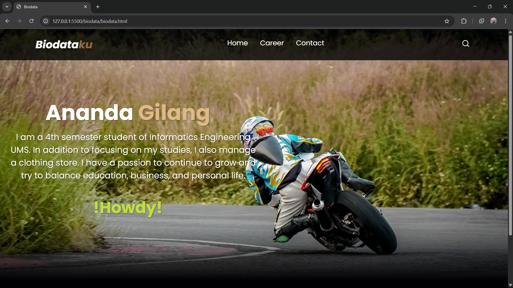
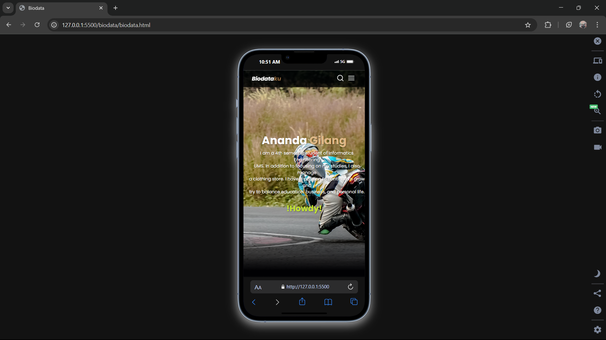
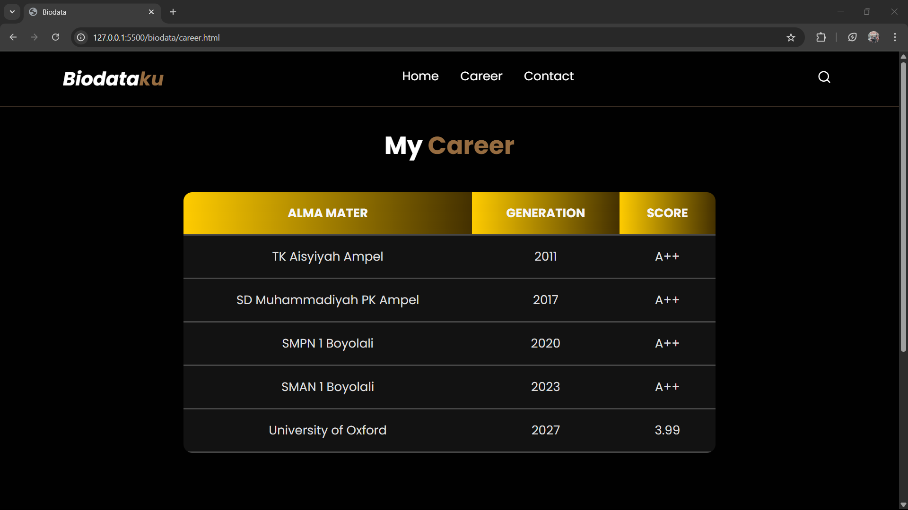
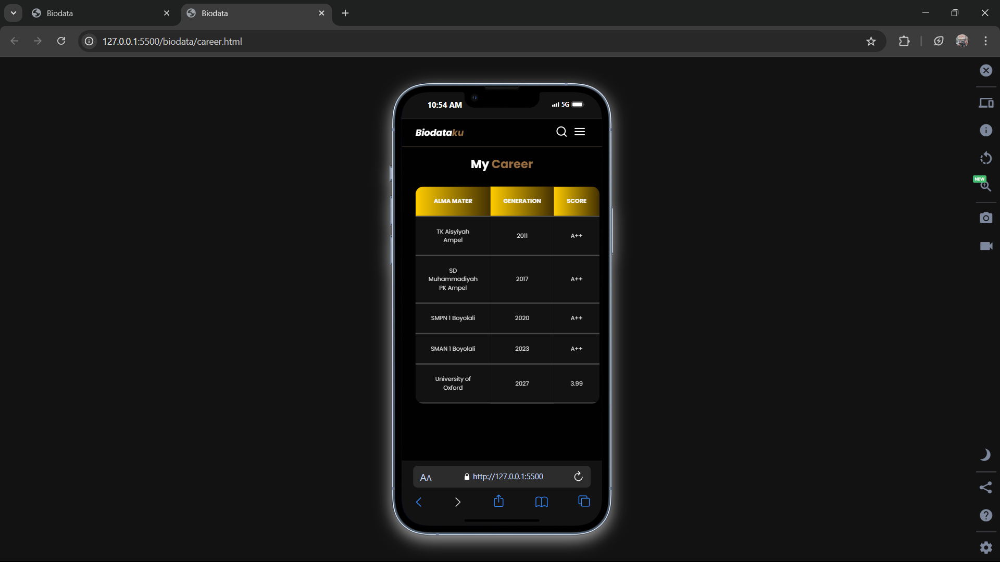
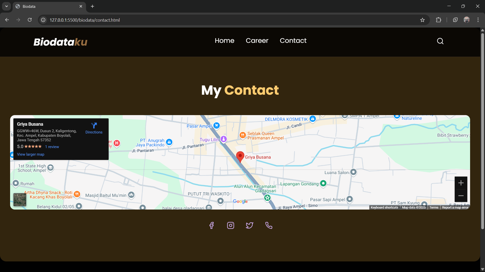
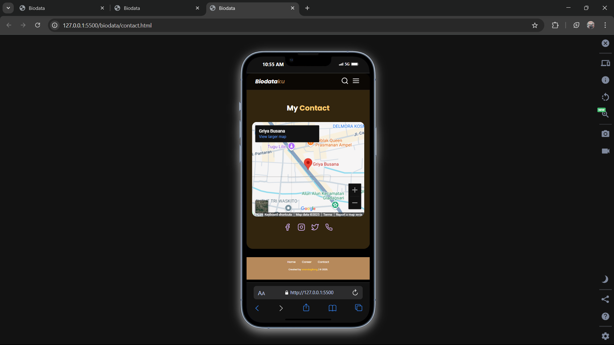

# DESKRIPSI PROJECT

### A. TUJUAN

Tujuan dari pembuatan project ini adalah untuk membuat website personal branding yang menampilkan biodata pribadi, kontak, serta pengalaman yang pernah dimiliki.

### B. FITUR UTAMA

- Halaman Home yang berisi deskripsi singkat diri sendiri
- Halaman Porfolio berisi pengalaman pribadi seperti project, sertifikasi, kejuaraan, ataupun pencapaian
- Halaman Contact berisi sosial media untuk berkomunikasi

### C. TEKNOLOGI YANG DIGUNAKAN

- HTML 5
- CSS 3
- JavaScript

# STRUKTUR FOLDER

### 1. Folder Root

Berisi file utama dan folder yang diperlukan didalam project

- folder css
- folder img
- folder js
- file biodata.html
- file contact.html
- file portfolio.html
- file index.html

### 2. Folder CSS

Berisi file yang digunakan untuk melakukan styling di file html

- file style.css

### 3. Folder Img

Berisi gambar yang diperlukan untuk halaman portofolio ataupun background

- bg.jpg

### 4. Folder js

Berisi file javascript untuk animasi yang diperlukan pada project

- script.js

# Tampilan web dan mobile setiap halaman
## 1. Halaman Profile
### Website

### Mobile

## 2. Halaman Portfolio
### Website

### Mobile

## 3. Halaman Contact
### Website

### Mobile

